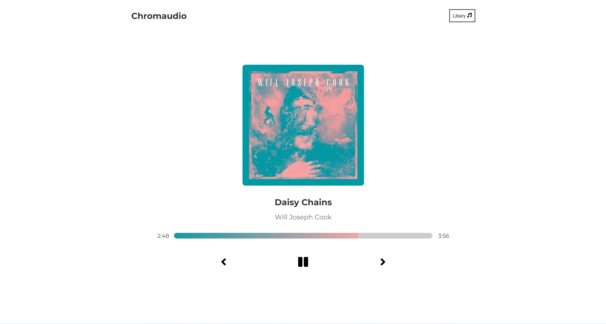
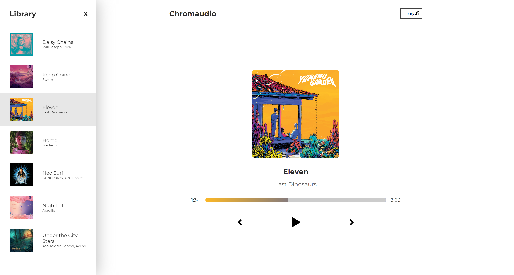

# Chromaudio

Chromaudio is a minimalistic music playing app that plays a hard-coded list of 7 songs. With Chromaudio, you can easily play and control music playback, skip songs, and switch between tracks in the playlist. 

## Features

- Play and pause songs
- Skip to the next song
- Restart the current song
- Go to the previous song
- Display the list of songs in the library
- Switch between tracks in the playlist by clicking on the library
- Save current song and current time using local storage

## Technologies Used

- React
- SASS

## Notes and future improvements
- While the design is responsive, some playback features behave finicky on mobile
- Add a search feature in library
- Add volume control

## Credits

Chromaudio was developed by Marshall Brown for the purpose of learning and practicing web development skills. 

